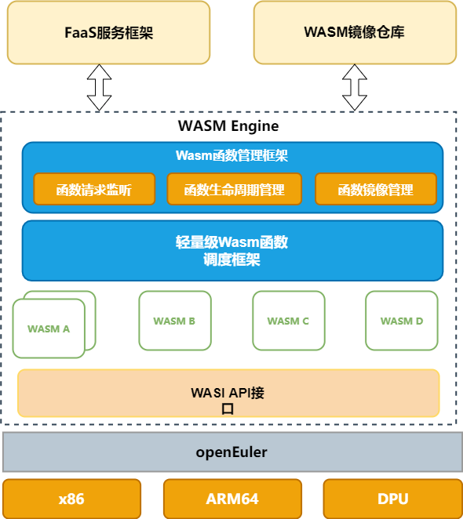

# WasmEngine

## 介绍

WasmEngine是一个轻量级的WebAssembly函数引擎，基于WebAssembly沙箱级安全隔离模型，提供高并发函数执行、毫秒级函数极速冷启动能力。

**WasmEngine架构图**




## 接口说明

业界流行的FaaS框架一般采用HTTP协议的Restful的API接口，对接后端的函数执行引擎，WasmEngine引擎也采用类似方案，提供了一组Restful风格的faas-provider API接口，提供函数的增删改查功能以及函数调用功能接口。

详细的接口定义如下：

**deploy函数部署接口**

- HTTP 请求类型：POST
- URL链接：/function/deploy
- 输入参数：JSON格式，{function_name: String, function_image: String, wasi_cap: bool}
- 返回值：HTTP的状态码和消息内容或操作错误失败信息

**delete删除函数接口**

- HTTP请求类型：POST
- URL链接：/function/delete
- 输入参数：JSON格式，{function_name: String}
- 返回值：HTTP的状态码和消息内容或操作错误失败信息

**list查询所有函数接口**

- HTTP请求类型：GET
- URL链接：/function/list
- 输入参数：不涉及
- 返回值：HTTP的状态码和消息内容，其中消息内容包括所有已部署到节点上的函数列表或查询失败的错误信息

 **query函数查询接口**

- HTTP请求类型：POST
- URL链接：/function/query
- 输入参数：JSON格式，{function_name: String}
- 返回值：HTTP的状态码和消息内容，其中消息内容包括查询函数的详细信息或失败错误信息

**query函数查询接口**

- HTTP请求类型：POST
- URL链接：/function/invoke
- 输入参数：JSON格式，{function_name: String, args: HashMap<String, String>}，其中args中存放的是函数参数kv形式的简直对，对于无key类型的函数参数类型，默认从value中取值作为参数
- 返回值：HTTP的状态码和消息内容，其中消息内容包括查询函数的详细信息或失败错误信息

## 编译安装教程

WasmEngine采用Rust语言开发，因此依赖于Rust语言的编译工具链进行编译构建。

**Rust语言环境安装**
Rust安装部署可参考[官方文档说明](https://www.rust-lang.org/tools/install)

**WasmEngine编译**

```bash
$ cd WasmEngine

$ cargo build --release
   Compiling libc v0.2.126
   Compiling proc-macro2 v1.0.36
   Compiling unicode-xid v0.2.2
   Compiling syn v1.0.84
   Compiling cfg-if v1.0.0
   ...
   Finished release [optimized] target(s) in 3m 41s

# 编译生成的二进制文件存放的路径如下
$ ls target/release/
build  deps  examples  incremental  libwasm_engine.d  libwasm_engine.rlib  wasm_engine  wasm_engine.d
```

**Rust Wasm编译工具链安装**

Rust编译工具链支持编译成wasm相关的target目标格式有：

```bash
rustup target list | grep wasm
wasm32-unknown-emscripten
wasm32-unknown-unknown
wasm32-wasi
```

这三种不同target目标格式的区别：
- **wasm32-unknown-emscripten**：Emscripten模式，通过Emscripten编译工具链emcc将代码编译成wasm应用，其中wasm应用中也会通过import的方式依赖于Emscripten提供的abi接口，通常用于浏览器场景
- **wasm32-unknown-unknown**：Wasm标准模式，完全没有外部依赖的wasm标准格式，不会通过import依赖外部接口能力，通常只具有数值计算能力
- **wasm32-wasi**：WASI模式，wasm应用通过import导入外部依赖的wasi接口能力，通过wasi接口，wasm应用具有文件目录操作、网络连接等这些扩展能力

在服务器场景下，当前只支持`wasm32-unknown-unknown`和`wasm32-wasi`这两种目标格式。

具体的安装方法如下：
```bash
$ rustup target add wasm32-unknown-unknown wasm32-wasi

# 安装完成之后，对应target之后会有(installed)标识
$ rustup target list | grep wasm
wasm32-unknown-emscripten
wasm32-unknown-unknown (installed)
wasm32-wasi (installed)
```


## 代码结构

* benches：存放了benchmark代码，其中包含了`gcd`, `echo_string`和`authentication` 三种不同测试函数的wat格式文件
* experiments/application: 存放了一些常见的可编译成Wasm格式的函数代码
* src/main.rs：WasmEngine引擎的主入口，定义了Restfult API访问接口
* src/wrapper: 对底层WebAssembly Runtime运行时的封装
* src/function_store: 存放了Wasm函数镜像管理和Wasm Module实例管理代码 

## 使用说明

1. 在一个终端中启动WasmEngine应用

```bash
# wasm_engine应用需要root权限才能执行
$ su root

# 设置RUST_LOG输出的crate和日志级别
$ export RUST_LOG=wasm_engine=debug

# wasm_engine默认监听在主机的10000端口上
$ ./wasm_engine
2022-07-28T12:32:10.007200Z  INFO wasm_engine::function_store::local_store: no persist json file exist, restore end
2022-07-28T12:32:10.007255Z  INFO wasm_engine: WasmEngine listening on http://0.0.0.0:10000, waiting for request...
```

2. 编译experiments目录中给定的函数样例
```bash
# 编译experiments目录中给定的函数样例
$ make apps

Building: fibonacci
    Finished release [optimized] target(s) in 0.00s
Building: hello
    Finished release [optimized] target(s) in 0.00s
Building: authentication
    Finished release [optimized] target(s) in 0.28s
Building: authentication-wasi
    Finished release [optimized] target(s) in 0.00s
```

编译完成之后，就可以在experiments/application/的各个函数源码目录下面的target目录下找到生成的wasm函数。

例如，`authentication`函数编译生成的wasm文件路径为`target/wasm32-unknown-unknown/release/authentication.wasm`

3. 接下来就是将编译生成的Wasm函数二进制文件打包成容器镜像格式，并上传到函数镜像仓库中，等待WasmEngine部署时进行拉去。

	Wasm函数镜像的制作方法，可以参考下面**Wasm 函数镜像制作**小节的介绍说明。

4. WasmEngine 提供Restful API接口说明

下面以`authentication`和`hello`函数为例函数部署、查询、删除、调用的介绍

**部署authentication函数**
```bash
$ curl --location --request POST 'localhost:10000/function/deploy' \
--header 'Content-Type: application/json' \
--header 'Content-Type: text/plain' \
--data-raw '{
    "function_name": "authentication",
    "function_image": "127.0.0.1:5000/authentication-wasm:v4",
    "wasi_cap": false
}'

status code: 200, message: deploy function authentication successfully!
```

**部署hello函数**
```bash
$ curl --location --request POST 'localhost:10000/function/deploy' \
--header 'Content-Type: application/json' \
--header 'Content-Type: text/plain' \
--data-raw '{
    "function_name": "hello",
    "function_image": "127.0.0.1:5000/hello-wasm:v2",
    "wasi_cap": true
}'

status code: 200, message: deploy function hello successfully!
```

**查询全部已部署函数**
```bash
$ curl --location --request GET 'localhost:10000/function/list' \
--header 'Content-Type: application/json' \
--header 'Content-Type: text/plain'

status code: 200, message: all deployed function info: [{func_name: authentication, func_image_name: 127.0.0.1:5000/authentication-wasm:v4, wasi_cap: false}, {func_name: hello, func_image_name: 127.0.0.1:5000/hello-wasm:v2, wasi_cap: true}]
```

**查询authentication函数信息**
```bash
$ curl --location --request POST 'localhost:10000/function/query' \
--header 'Content-Type: application/json' \
--header 'Content-Type: text/plain' \
--data-raw '{
  "function_name": "authentication"
}'
status code: 200, message: queried function info: FunctionEntry { func_name: "authentication", func_image_name: "127.0.0.1:5000/authentication-wasm:v4", func_local_path: "/var/lib/wasmengine/functions/authentication/authentication.wasm", wasi_cap: false }
```

**调用authentication函数**
```bash
$ curl --location --request POST 'localhost:10000/function/invoke' \
--header 'Content-Type: application/json' \
--header 'Content-Type: text/plain' \
--data-raw '{
  "function_name": "authentication",
  "args": {"arg_uri": "yes", "arg_body": "yes", "arg_secret": "12345"}
}'

status code: 200, message: {"status":"403","body":"<html><h1>Auth Forbidden!</h1><p>hash c5187dd86a648a819f527c7a8a4f7bf4 secret 12345</p></html>"}
```

**删除已部署的hello函数**
```bash
$ curl --location --request POST 'localhost:10000/function/delete' \
--header 'Content-Type: application/json' \
--header 'Content-Type: text/plain' \
--data-raw '{
  "function_name": "hello"
}'

status code: 200, message: delete function hello successfull!
```


## Wasm 函数镜像制作

WasmEngine加载运行的Wasm函数同样需要类似容器镜像的管理和分发能力，因此WasmEngine复用了容器镜像仓库统一管理和分发的能力，开发者将Wasm函数制作成容器镜像，WasmEngine从远端镜像仓库拉取。

开发者可以通过openEuler上的isula build或者docker build容器镜像构建工具来进行容器镜像构建。

1. 创建一个空的目录，将上一步生成的wasm格式应用文件拷贝到该空目录中
```bash
$ mkdir build && cd build
$ cp target/wasm32-unknown-unknown/release/authentication.wasm .
```
2. 编写容器镜像构建所需的Dockerfile，内容如下
```bash
$ cat Dockerfile
FROM scratch
ADD authentication.wasm /
```
3. 执行Wasm容器镜像编译构建
```bash
$ sudo docker build --tag 127.0.0.1:5000/authentication-wasm:v2 .
Sending build context to Docker daemon  1.787MB
Step 1/2 : FROM scratch
 --->
Step 2/2 : ADD authentication.wasm /
 ---> 897a9e7a1ce6
Successfully built 897a9e7a1ce6
Successfully tagged 127.0.0.1:5000/authentication-wasm:v2
```
4. 将容器镜像push到容器镜像仓库

如果用于本地开发验证，开发者可以通过`registry`镜像在本地启动一个容器镜像仓库服务。
```bash
$ sudo docker run -itd -v /home/flyflypeng/registry:/var/lib/registry -p 5000:5000 --restart=always --name registry registry:latest
```

push容器镜像到容器镜像仓库：
```bash
$ sudo docker push 127.0.0.1:5000/authentication-wasm:v2
The push refers to repository [127.0.0.1:5000/authentication-wasm]
720b9e537c85: Pushed
v2: digest: sha256:a7b8e58e4b9c2abba6a39636dbc904e01c4cfa7e1d4cc6a97f8e955e148af41e size: 527
```

## 注意事项

-  Wasm目标格式需要满足WebAssembly Spec 1.0正式标准
- 如果应用程序需要WASI接口能力支持，只支持通过wasi-sdk或Rust语言的wasm32-unknown-wasi编译工具链编译生成的Wasm文件
- 不支持设置每个函数调用的资源限额
- 只支持单函数运行模型，不支持函数间调用模型
- 一个Wasm函数镜像中只允许有一个wasm格式模块文件
